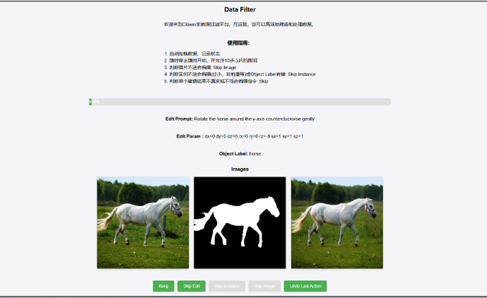
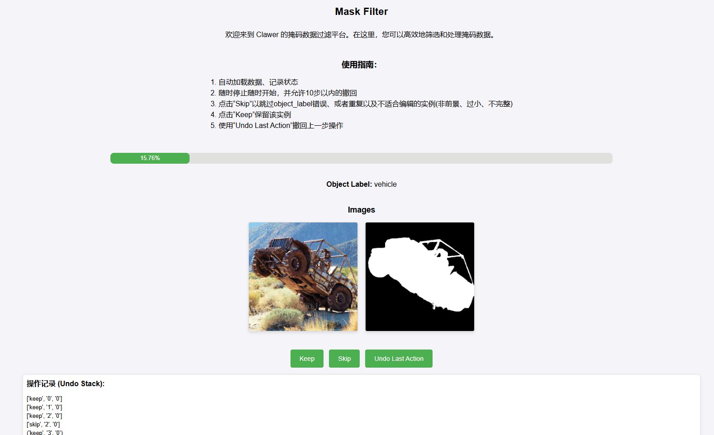
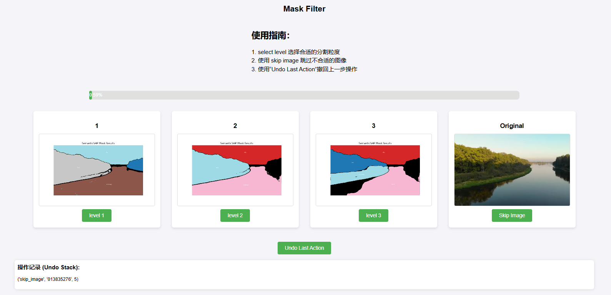

# 数据过滤与预过滤 Flask 项目

本项目提供了两个 Flask 应用，用于不同的数据过滤任务。`Generate 数据过滤` 任务用于处理生成类数据，而 `Grounding 数据预过滤` 任务则专注于掩码数据的预处理。

---

## 项目结构

```plaintext
flask/
│
├── templates/                   # 存放 HTML 模板文件
│   ├── filter.html              # Generate 数据过滤模板
│   └── Grounding_filter.html    # Grounding 数据预过滤模板（用于掩码过滤任务）
│
├── flask_data_filter.py         # 主 Flask 应用文件，负责 Generate 数据过滤任务
├── flask_mask_filter.py         # 主 Flask 应用文件，负责 Grounding 数据预过滤任务
├── flask_filter.sh              # 启动 Generate 数据过滤任务的脚本
└── flask_filter_pre.sh          # 启动 Grounding 数据预过滤任务的脚本
```

## 使用引导

   ```bash
   pip install flask
   ```

## 使用示范

### 启动 Generate 数据过滤任务

1. 运行程序示例1：
     ```bash
   python flask_data_filter.py --dir {dataset_basedir} --port {port} --subset_id {subset_id}
   ```
2. 运行程序示例2(脚本中修改参数)：
   ```bash
   bash flask_filter.sh
   ```

2. 打开浏览器，访问 `http://127.0.0.1:port` 查看 `Generate 数据过滤` 界面。其中`port`为参数中你指定的端口

### 启动 Grounding 数据预过滤任务(已废弃)

1. 运行程序示例1：
     ```bash
   python flask_mask_filter.py --dir {dataset_basedir} --port {port} --subset_id {subset_id}
   ```
2. 运行程序示例2(脚本中修改参数)：
   ```bash
   bash grounding_filter.sh
   ```

### 启动 Semantic-SAM & RAM++ 数据预过滤任务(Latest)

1. 运行程序示例1：
     ```bash
   python flask_mask_filter_plus.py --dir {dataset_basedir} --port {port} --subset_id {subset_id}
   ```
2. 运行程序示例2(脚本中修改参数)：
   ```bash
   bash semantic_sam_flter.sh
2. 打开浏览器，访问 `http://127.0.0.1:port` 查看 `Grounding 数据过滤` 界面。其中`port`为参数中你指定的端口

## 示例界面

### Generate 数据过滤界面示例


### Grounding 数据预过滤界面示例


### Semantic-SAM & RAM++ 数据预过滤任务界面示例

## 注意事项

- 见浏览器界面中的提示，按照提示进行数据过滤操作。
- 目前仅支持服务器用户在8706上运行程序(working on it!)

  

